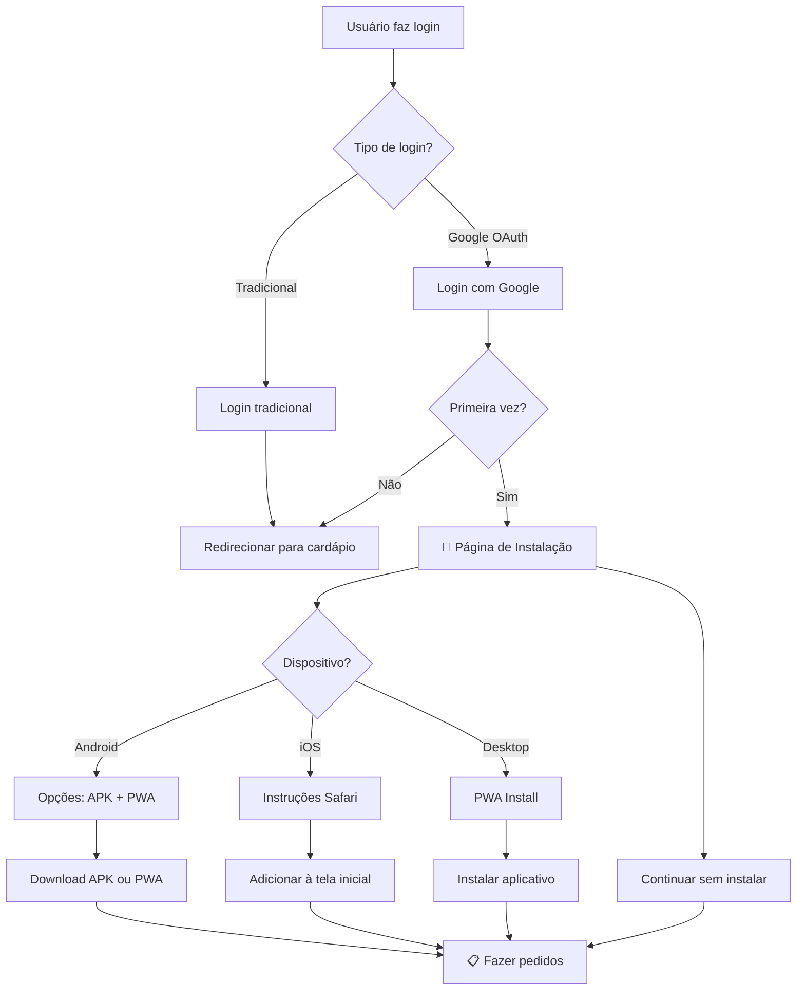

# 📱 Implementação da Página de Instalação

## ✅ O que foi implementado

Foi criado um sistema completo de onboarding e instalação do aplicativo móvel que é executado após o login com Google.

## 🔄 Fluxo Implementado



## 📂 Arquivos Criados

### 1. `install-app.html`
Página principal de instalação com:
- **Header**: Informações do usuário logado
- **Hero Section**: Apresentação do aplicativo
- **Vantagens**: Lista das funcionalidades do app
- **Opções de Instalação**: Específicas por dispositivo
- **Ações**: Continuar sem instalar ou ir para cardápio

### 2. `css/install-app.css`
Estilos responsivos incluindo:
- Design moderno com gradientes
- Animações suaves
- Layout responsivo para mobile/desktop
- Estados hover e loading
- Modal para instruções detalhadas

### 3. `js/install-app.js`
Funcionalidades JavaScript:
- **Detecção de dispositivo**: Android, iOS, Desktop
- **PWA Installation**: API de instalação nativa
- **Download APK**: Para dispositivos Android
- **Instruções iOS**: Modal com passos detalhados
- **Notificações**: Feedback visual ao usuário

## 🎯 Funcionalidades por Dispositivo

### 📱 Android
```javascript
- Botão "Baixar APK" → Download direto
- Botão "Instalar do Navegador" → PWA
- Modal com instruções de instalação
- Detecção automática do dispositivo
```

### 🍎 iOS (iPhone/iPad)
```javascript
- Instruções passo-a-passo para Safari
- Orientação visual com ícones
- Processo "Adicionar à Tela Inicial"
- Suporte para PWA nativo
```

### 💻 Desktop
```javascript
- PWA Installation via beforeinstallprompt
- Fallback para adicionar aos favoritos
- Detecção de suporte a PWA
- Instalação com um clique
```

## 🔧 Integração com Login

### Modificações em `login.js`:
```javascript
// Após login com Google
if (shouldRedirectToInstall()) {
    window.location.href = '/install-app.html';
} else {
    window.location.href = '/cardapio.html';
}

// Lógica de decisão
function shouldRedirectToInstall() {
    const visited = localStorage.getItem('installPageVisited');
    const skipped = localStorage.getItem('skipInstall');
    const isInstalled = localStorage.getItem('appInstalled');
    const isPWA = window.matchMedia('(display-mode: standalone)').matches;
    
    return !visited && !skipped && !isInstalled && !isPWA;
}
```

## ✨ Funcionalidades Especiais

### 🎨 Design Responsivo
- **Mobile First**: Otimizado para dispositivos móveis
- **Animações**: Transições suaves e feedback visual
- **Gradientes**: Design moderno e atrativo
- **Ícones**: FontAwesome para elementos visuais

### 💾 Persistência de Estado
```javascript
localStorage.setItem('installPageVisited', 'true');     // Visitou a página
localStorage.setItem('skipInstall', 'true');           // Escolheu pular
localStorage.setItem('appInstalled', 'true');          // App instalado
localStorage.setItem('apkDownloaded', 'true');         // APK baixado
```

### 🔄 PWA Integration
```javascript
// Event listeners para PWA
window.addEventListener('beforeinstallprompt', (e) => {
    deferredPrompt = e;
    // Mostrar botão de instalação
});

window.addEventListener('appinstalled', (evt) => {
    // Redirecionar após instalação
    window.location.href = 'cardapio.html';
});
```

## 📋 Manifest PWA Atualizado

### Melhorias no `manifest.json`:
```json
{
  "name": "Quiosque Beach - Pedidos",
  "description": "Faça seus pedidos rapidamente!",
  "start_url": "/cardapio.html",
  "display": "standalone",
  "orientation": "portrait-primary",
  "shortcuts": [
    {
      "name": "Cardápio",
      "url": "/cardapio.html"
    },
    {
      "name": "Meus Pedidos", 
      "url": "/inicio.html"
    }
  ]
}
```

## 🎯 Experiência do Usuário

### 1️⃣ **Login com Google**
- Usuário faz login via OAuth
- Sistema detecta se é primeira visita

### 2️⃣ **Página de Instalação**  
- Apresentação do app e vantagens
- Detecção automática do dispositivo
- Opções específicas de instalação

### 3️⃣ **Instalação**
- **Android**: APK ou PWA
- **iOS**: Instruções Safari
- **Desktop**: PWA nativo

### 4️⃣ **Fallback**
- Opção "Continuar sem instalar"
- Não forçar a instalação
- Lembrar da escolha do usuário

## 🔗 URLs Configuráveis

### APK Download:
```javascript
function getApkDownloadUrl() {
    // GitHub Releases
    return 'https://github.com/usuario/repo/releases/latest/download/app.apk';
    
    // Servidor próprio
    const baseUrl = window.location.origin;
    return `${baseUrl}/downloads/quiosque-beach.apk`;
}
```

## 🚀 Como Testar

### 1. **Login com Google**:
```bash
1. Acesse: http://localhost:8000/login.html
2. Clique em "Continuar com Google"
3. Complete o OAuth
4. Será redirecionado para install-app.html
```

### 2. **Testar por Dispositivo**:
```bash
# Android (Chrome)
- Abrir DevTools > Device Mode > Selecionar dispositivo Android
- Testar download APK e PWA

# iOS (Safari Simulator)
- Testar instruções de "Adicionar à Tela Inicial"

# Desktop
- Testar instalação PWA nativa
```

### 3. **Testar Estados**:
```bash
# Primeira visita
localStorage.clear();

# Usuário que já pulou
localStorage.setItem('skipInstall', 'true');

# App já instalado
localStorage.setItem('appInstalled', 'true');
```

## ✅ Resultado Final

O usuário agora tem uma experiência completa:

1. **Faz login** com Google OAuth
2. **É apresentado** às vantagens do aplicativo móvel
3. **Recebe opções** específicas para seu dispositivo
4. **Pode instalar** o app nativo ou PWA
5. **Ou continuar** usando o navegador
6. **Não é incomodado** novamente após a escolha

A implementação é **profissional**, **responsiva** e **user-friendly**, proporcionando uma excelente experiência de onboarding para os usuários do Quiosque Beach! 🏖️
